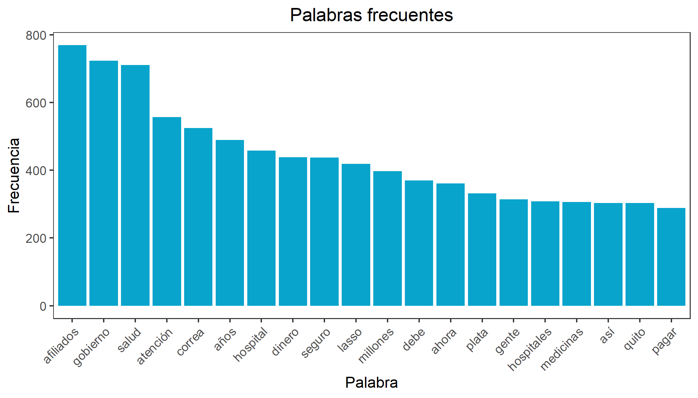
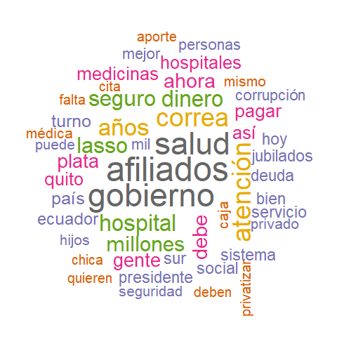
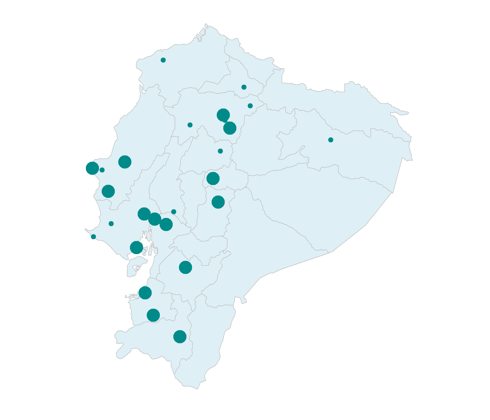

```{r setup, include=FALSE}
knitr::opts_chunk$set(echo = F)
```

Es de conocimiento público que el IESS tiene problemas de escasez de medicinas, de citas médicas dentro de tiempos oportunos y de equipamiento e insumos médicos. Estos problemas se han dado desde hace 4 años, algo que ha afectado a las poblaciones más vulnerables del país. La ciudadanía ha venido haciendo denuncias sobre varios de estos problemas.

La paciencia se colmó el 13 de mayo cuando el sistema informático del IESS, el cual permitía hacer uso de los diversos servicios de salud, colapsó [@espinosa_sistema_2022]. Miles de ciudadanos hicieron conocer su sentir mediante varias redes sociales, siendo Twitter la más utilizada por sus características propias de un espacio de expresión de opiniones.

Es esta la razón por la que se llevó a cabo una investigación sobre la opinión de la ciudadanía ecuatoriana sobre el IESS. Mediante la API de Twitter se descargaron 10 mil tweets ecuatorianos con menciones del IESS extrayéndose varios resultados que serán presentados a continuación.

## Entonces, ¿qué piensan los ecuatorianos?

### Las palabras más repetidas

De una muestra se extrajeron las 20 palabras más repetidas. Éstas fueron:

1. afiliados
2. gobierno
3. salud

Las 17 palabras restantes se pueden observar en el siguiente gráfico. Cada barra representa una palabra, la cual está listada en el eje horizontal. La altura de cada barra es la cantidad de veces que se repitió dicha palabra en los tweets analizados. Por ejemplo, la palabra *afiliados* se repitió alrededor de 790 veces.

```{r graph-1, out.width="70%", fig.align = 'center'}

```

A su vez, se creó una nube de 50 palabras donde el tamaño de la misma es relativo a su frecuencia en los tweets. Este gráfico hace posible crear relaciones visuales entre las palabras repetidas y encontrar patrones.

```{r graph-2, out.width="50%", out.extra='style="float:right; padding:10px"'}

```

En particular, las palabras: **corrupción, caja, millones, dinero, pagar, debe**; se enlazan dentro de una discusión sobre actos de corrupción con los recursos del IESS.

Dentro del gráfico se pueden observar palabras asociadas a la insatisfacción de los usuarios hacia los servicios de salud del IESS. **Falta, turno, medicinas, debe, deuda, hospital** son términos que podrían reflejar la inconformidad de los pacientes del IESS en cuanto a sus servicios, resaltando la falta de eficacia percibida en los procesos de asignación de citas, suministro de medicinas y atención al paciente.

Asimismo, existe un tema contemporáneo al día de extracción de los datos, la privatización del IESS. La palabra **privatizar** fue mencionada 171 veces. En 2021, la Internacional de Servicios Públicos (ISP) examinó las condiciones financieras del IESS y propuso la privatización como una solución inmediata [@cornejo_condiciones_2022]. Sin embargo, en Febrero de 2022, Francisco Cepeda, entonces presidente del directorio del IESS, aseguró que no se privatizará la institución y que, al contrario, están trabajando sobre la repotenciación de los hospitales [@davila_no_2022]. Esta confrontación de ideas se traduce en un debate ciudadano, entre personas que están tanto a favor como en contra de la privatización.

En fin, el IESS experimenta problemas en distintas aristas. Ecuador Decide, en su diagnóstico del IESS y del Banco del Instituto Ecuatoriano de Seguridad Social (BIESS), publicado el 2020, enfatiza en que hay tres puntos críticos para estas instituciones: el deterioro de su institucionalidad, el irrespeto a su autonomía y la ausencia de armonía entre la Ley de Seguridad Social (LSS) y la Constitución ecuatoriana [@ecuador_situacion_2020].

### El tweet más retuiteado

El tweet más retuiteado fue del usuario **\@bonautill**. El tweet relata una escena escalofriante e inhumana sobre un adulto mayor abandonado y sin atención dentro del Hospital del Día IESS Sangolquí.

<center><blockquote class="twitter-tweet"><p lang="es" dir="ltr">Mi padre muerto y deshumanizado arrojado en una silla en Emergencias del hospital del Iess de Sangolquí, atendieron pacientes junto a su cadáver en la misma sala mientras llegaba la carroza: NULO CONTROL D BIOSEGURIDAD Y CERO EMPATÍA <a href="https://twitter.com/IESSec?ref_src=twsrc%5Etfw">@IESSec</a> <a href="https://twitter.com/LassoGuillermo?ref_src=twsrc%5Etfw">@LassoGuillermo</a> <a href="https://t.co/YcZk1B1wgX">pic.twitter.com/YcZk1B1wgX</a></p>&mdash; Andy (@bonautill) <a href="https://twitter.com/bonautill/status/1554130623505510400?ref_src=twsrc%5Etfw">August 1, 2022</a></blockquote> <script async src="https://platform.twitter.com/widgets.js" charset="utf-8"></script></center>

### ¿De qué parte del país provienen la mayoría de tweets?

```{r graph-3, out.width="60%", out.extra='style="float:left; padding:10px"'}

```

Para terminar, se buscaron los sectores del Ecuador de donde se publican los tweets referentes al IESS.

En el mapa, el tamaño de cada punto es relativo a la cantidad de tweets publicados desde ese lugar; mientras más grande sea el punto, más tweets son provenientes de esa ubicación.

Los dos puntos más grandes corresponden a Pichincha y Guayas, provincias cuyas capitales son Quito y Guayaquil. Desde Pichincha se emitieron 79 tweets, y desde Guayas 62 tweets.

En el mapa se marcan 6 provincias de la región litoral: Esmeraldas, Manabí, Santo Domingo de los Tsáchilas, Santa Elena, Guayas y El Oro.

Por otro lado, de la región interandina, también se marcan 6 provincias: Pichincha, Imbabura, Cotopaxi, Tungurahua, Azuay y Loja. En cuanto a la amazonía ecuatoriana, únicamente se tienen registros de Orellana. Es probable que la falta de tweets escritos desde la región amazónica se deba a pocos puntos de conexión a internet.

<br />
<br />

## Implicaciones
Después del análisis efectuado se puede recapitular en:

- Los problemas del IESS han venido acumulándose desde hace varios años, algo que se refleja en la negatividad de los tweets de los ciudadanos.
- La consciencia colectiva ecuatoriana califica al IESS como un servicio ineficiente, lento y que cada vez está peor.
- Los tweets reflejan que los ecuatorianos relacionan al Instituto de Seguridad Social con los afiliados, el gobierno y la salud.
- El tweet con más retuits figura un servicio de salud que ha llegado a la ecpatía e inhumanización de los pacientes.
- Se recalcan temas de conversación como la corrupción, falta de medicinas y privatización del instituto.
- Gran parte de los tweets provienen de Guayas y Pichincha. Hay un decremento significativo en la cantidad de tweets publicados desde la amazonía del país.

## Referencias